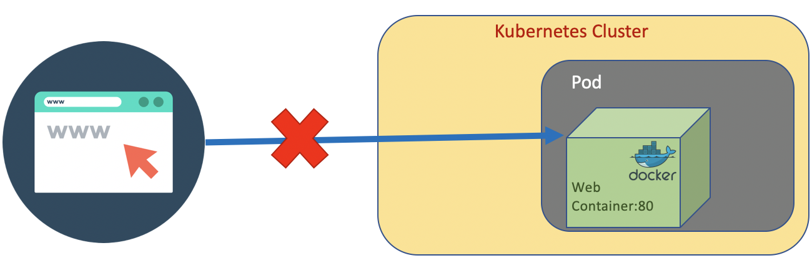

# Creating a Pod

Let's create a simple <code>pod.yaml</code> using a docker image [richardchesterwood/k8s-fleetman-position-tracker](https://hub.docker.com/r/richardchesterwood/k8s-fleetman-webapp-angular)

``` yaml
apiVersion: v1
kind: Pod
metadata:
  name: webapp
  labels:
    app: webapp # can be any label ex, myapp: webapp
spec:
  containers:
  - name: webapp
    image: richardchesterwood/k8s-fleetman-webapp-angular:release0
```

To create a Pod, run the following command
``` bash

# apply will create if it does not exist, and update if it exists
kubectl apply -f pod.yaml 
```

Operating to Pods can be done with the following command 
``` bash

# get all pods
kubectl get pods

# get the namespaces
kubectl get namespaces

# get pods with namespace
kubectl get pods --all-namespaces
kubectl get pods -A

# We can also check all resources at once
kubectl get all

# Deleting Pod. The actual pod.yaml on your local working directory will not be deleted
kubectl delete -f pod.yaml

# delete using pod name
kubectl delete pod {POD_NAME}
kubectl delete po {POD_NAME}

# delete all pods
kubectl delete pods --all

# delete all pods in specfific namespace
kubectl delete pods --all --namespace {NAMESPACE_NAME}
```


If we got status <code>ContainerCreating</code> for long time, we can consider doing a full reboot of VMs that are running the Kubernetes master node and Kubernetes worker nodes. 

If we get an error while creating Pod, we can check the detail with <code>describe</code> command.
``` bash
kubectl describe pod {POD_NAME}
```

we can also check the log
``` bash
kubectl logs --tail=[number] -p {POD_NAME}
```

# Interacting with Container
Pod is not visible from outside the cluster. 



But we still able to connect and execute command inside the pod.

``` bash
kubectl exec {POD_NAME} {COMMAND}
kubectl exec webapp ls
```

We could also get a shell interraction inside the container in the pod.
``` bash

# execute shell command
kubectl -it exec {POD_NAME} sh
kubectl -it exec webapp sh

```

Inside the container we can do 
``` bash
# for the example
wget http://localhost:80
```

The other port characteristics are having shot lifetime, regularly die, and regularly recreated.

# References
1. https://kubernetes.io/docs/concepts/workloads/pods/
2. https://signoz.io/blog/kubectl-logs-tail/