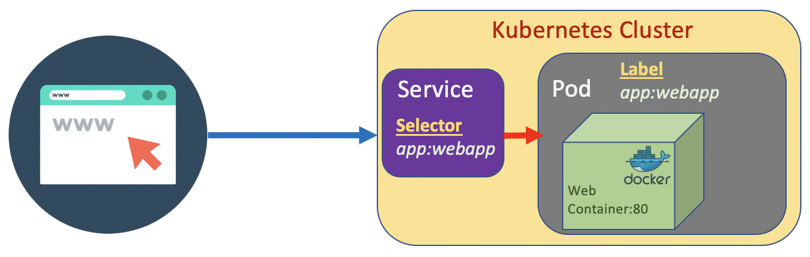
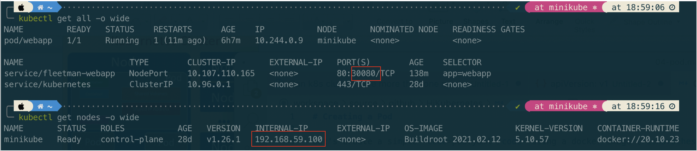
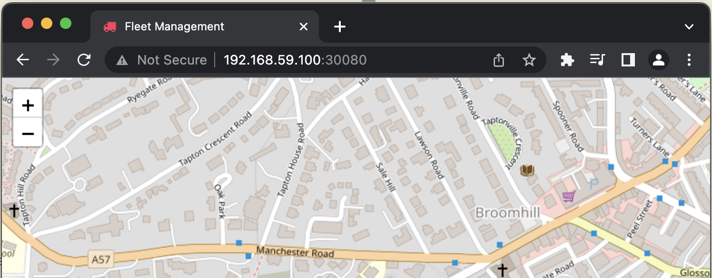

# Creating a Service
a Service is a method for exposing a network application that is running as one or more Pods in your cluster. Different from Pod, Service is a long running object. A service has an IP address and has stable fixed port. We can attach a Service to a Pod.

The Pod has a <code>label</code> which is a key value pair. The Service has a <code>selector</code> which is a key value pair to. The Service pointing to the Pod based on the match the key value pair on the <code>selector</code> and <code>lable</code>.



If a Service we create is designed to be access from internal cluster (such as microservice internal communication), we set the type to <code>ClusterIP</code>. On the other hand if we design it to be accessible from outside cluster, set the type to <code>NodePort</code>/.

The port that is allowed in Kubernetes cluster is greater than 30000

Let's create a <code>service.yaml</code>
``` yaml
apiVersion: v1
kind: Service
metadata:
  name: fleetman-webapp
  namespace: default
spec:
  # This defines which pods are going to be represented by this service
  # The service becomes a network endpoint for either other services
  # or maybe external users to connect to (browser)
  selector:
    app: webapp # # can be any selector according to the label defined in pod ex: myapp:webapp
  ports:
  - name: http
    port: 80
    # the nodeport should be greater than 30000
    nodePort: 30080 
  type: NodePort
```

``` bash
kubectl apply -f service.yaml
```
Once the service created, check the status of serice and get ip of node (in this case we use minikube).



Then open browser:
http://192.168.59.100:30080

