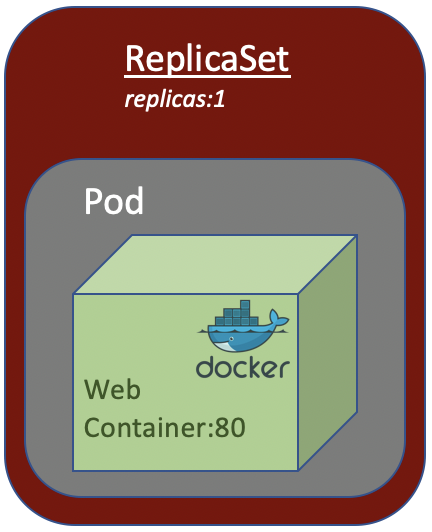

# About ReplicaSet
A ReplicaSet's purpose is to maintain number of Pod available at any given time. It is used to guarantee the availability of a specified number of identical Pods.

From the above picture, if the Pod die for any reason, Kubernetes will spring up a new one Pod to ensure the Pod availability.

In short, if want to deploy a Pod in Kubernates cluster, we could wrap it in a ReplicaSet to ensure its availability in the cluster in case the Pod die for any reason.
