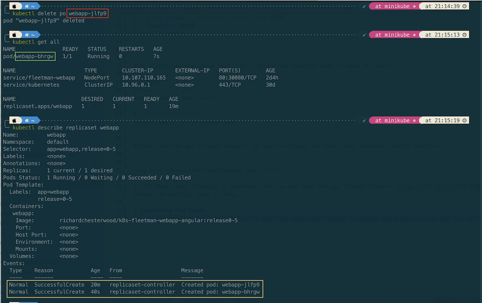

# About ReplicaSet
A ReplicaSet's purpose is to maintain number of Pod available at any given time. It is used to guarantee the availability of a specified number of identical Pods.


From the above picture, if the Pod die for any reason, Kubernetes will spring up a new one Pod to ensure the Pod availability.

In short, if want to deploy a Pod in Kubernates cluster, we could wrap it in a ReplicaSet to ensure its availability in the cluster in case the Pod dies for any reason.

# Creating ReplicaSet

Let's wrap the previous Pod in ReplicaSet in the following <code>replica-set.yaml</code>

``` yaml
apiVersion: apps/v1
kind: ReplicaSet
metadata:
  name: webapp
spec:
  replicas: 1
  selector:
    matchLabels:
      app: webapp
      release: "0-5"
  template: # template for the pod
    metadata:
      labels:
        app: webapp
        release: "0-5"
    spec:
      containers:
      - name: webapp
        image: richardchesterwood/k8s-fleetman-webapp-angular:release0-5

---
apiVersion: v1
kind: Service
metadata:
  name: fleetman-webapp
  namespace: default
spec:
  # This defines which pods are going to be represented by this service
  # The service becomes a network endpoint for either other services
  # or maybe external users to connect to (browser)
  selector:
    app: webapp # can be any selector according to the label defined in pod ex: myapp:webapp
    release: "0-5"
  ports:
  - name: http
    port: 80
    # the nodeport should be greater than 30000
    nodePort: 30080 
  type: NodePort

```

Before applying the above yaml, let's delete the previous pods to make it clean.

``` bash
# deleting all pods
kubectl delete pods --all

# creating replica-set
kubectl apply -f replicaset.yaml
```

Before open the app through browser, we could evaluate the ReplicaSet creation and the Service.


If the ReplicaSet creation as expected, then we can open the app through browser (http://192.168.59.100:30080) to ensure the service links to Pods.

# Simulating Pod Crash
To simulate Pod crash, let's delete the pod. The Kubernetes should recreated the a new similar pod for us.



On the detail checking of replica set shown that the pod recreated when it's deleted.
``` bash
kubectl describe replicaset {NAME_REPLICASET}
kubectl describe rs {NAME_REPLICASET}
```
