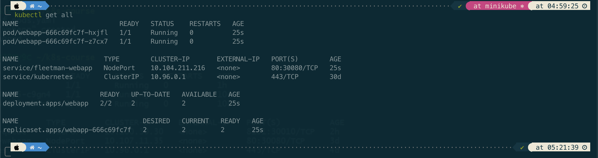
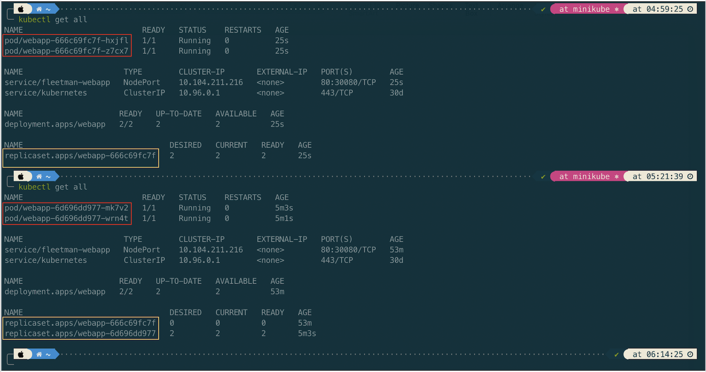
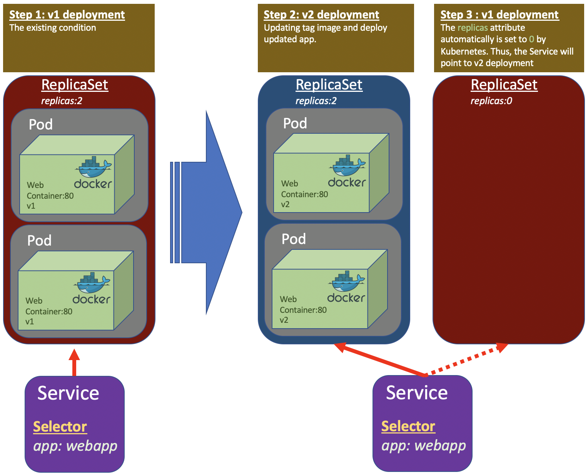
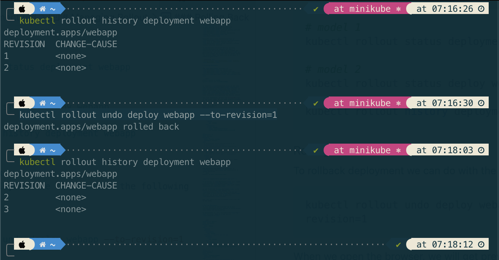

# About Deployment
In most cases we don't want to work with <code>Pods</code> directly. As well as <code>ReplicaSet</code>, we might want to work with <code>Deployment</code> instead. A <code>Deployment</code> provides declarative updates for <code>Pods</code> and <code>ReplicaSets</code>. 

Basically it's a more sophisticated form of <code>ReplicaSet</code>. It is a <code>ReplicaSet</code> with an additional feature. With a <code>Deployment</code>, we get automatic rolling updates with zero downtime.

In the previous section of Service, we did a rolling deployment by changing the labels of selector in the service. The rolling updates was zero downtime. But with <code>Deployment</code> we have more elegant way without have to manual change the selector label. We could also do rollback if something goes wrong.

> **Note:** <br/>
> Do not manage <code>ReplicaSets</code> owned by a <code>Deployment</code>. 

# Creating Deployment

The <code>yaml</code> structure of <code>Deployment</code> is similar with <code>ReplicaSet</code>. To demonstrate the <code>Deployment</code> creation, let's delete the previous <code>ReplicaSet</code> and <code>Service</code>.

``` bash
kubectl delete rs webapp
kubectl delete svc fleetman-webapp
```

In creating a <code>Deployment</code> we can copy the previous <code>ReplicaSet</code> <code>yaml</code> and modify the <code>kind</code> element. To make it more closer to real condition, we will remove the <code>release</code> in the <code>Pod</code> label and <code>Service</code> selector. Since we should not tightly to any specific version.

The first deployment, we will use **release0** tag of the docker image. We also make slightly increase the number of replica to 2.

``` yaml
apiVersion: apps/v1
kind: Deployment
metadata:
  name: webapp
spec:
  replicas: 2
  selector:
    matchLabels:
      app: webapp
  template: # template for the pod
    metadata:
      labels:
        app: webapp
    spec:
      containers:
      - name: webapp
        image: richardchesterwood/k8s-fleetman-webapp-angular:release0

---
apiVersion: v1
kind: Service
metadata:
  name: fleetman-webapp
  namespace: default
spec:
  # This defines which pods are going to be represented by this service
  # The service becomes a network endpoint for either other services
  # or maybe external users to connect to (browser)
  selector:
    app: webapp # can be any selector according to the label defined in pod ex: myapp:webapp
  ports:
  - name: http
    port: 80
    # the nodeport should be greater than 30000
    nodePort: 30080 
  type: NodePort

```

The next steps are saving the above yaml as <code>deployment.yaml</code> and executing it to create deployment.
``` bash
kubectl -f apply deployment.yaml
```



If we notice, a <code>Deployment</code> will create a corresponding a <code>ReplicaSet</code>. Meanwhile, the <code>ReplicaSet</code> will create corresponding <code>Pods</code>. 

We can think that a <code>Deployment</code> is an entity in Kubernetes that manages the <code>ReplicaSet</code> for us. So from now we don't need to work with the <code>ReplicaSet</code> directly, but we just need to work with <code>Deployment</code> instead.

Now, lets check and open in browser http://192.168.59.100:30080.


# Rolling Deployment
In this section we will simulate how we do a rolling deployment without needing to fiddle around with lables like we did before.

To demonstrate it, let's we update the <code>tag</code> of docker image to a new version <code>release0-5</code>.


``` yaml
apiVersion: apps/v1
kind: Deployment
metadata:
  name: webapp
spec:
  replicas: 2
  selector:
    matchLabels:
      app: webapp
  template: # template for the pod
    metadata:
      labels:
        app: webapp
    spec:
      containers:
      - name: webapp
        image: richardchesterwood/k8s-fleetman-webapp-angular:release0-5

---
apiVersion: v1
kind: Service
metadata:
  name: fleetman-webapp
  namespace: default
spec:
  # This defines which pods are going to be represented by this service
  # The service becomes a network endpoint for either other services
  # or maybe external users to connect to (browser)
  selector:
    app: webapp # can be any selector according to the label defined in pod ex: myapp:webapp
  ports:
  - name: http
    port: 80
    # the nodeport should be greater than 30000
    nodePort: 30080 
  type: NodePort

```
Then apply the updated <code>deployment.yaml</code> and compare the previous entities to the updated ones.



Now, lets check the updated app by opening in browser http://192.168.59.100:30080. The app should be updated.

How the Deployment does the elegant way ilustrated in the following picture.



# Managing Rollout

To check the rollout deployment status and history, run the commands.

``` bash
# model 1
kubectl rollout status deployment webapp

# model 2
kubectl rollout status deploy webapp

kubectl rollout history deployment webapp
```

### Rolling Back
To rollback deployment we can do with the following command

``` bash
kubectl rollout undo deploy webapp --to-revision=1
```




When we open the browser, we will get previous version. The revision number will keep increment as history tracking of Kubernates.