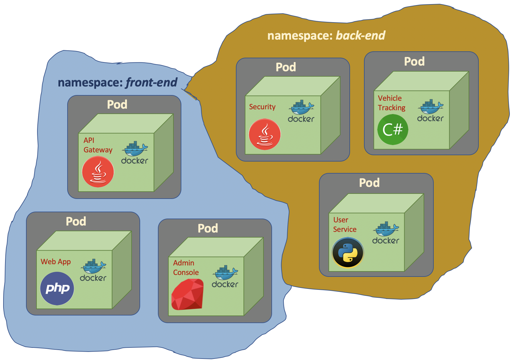
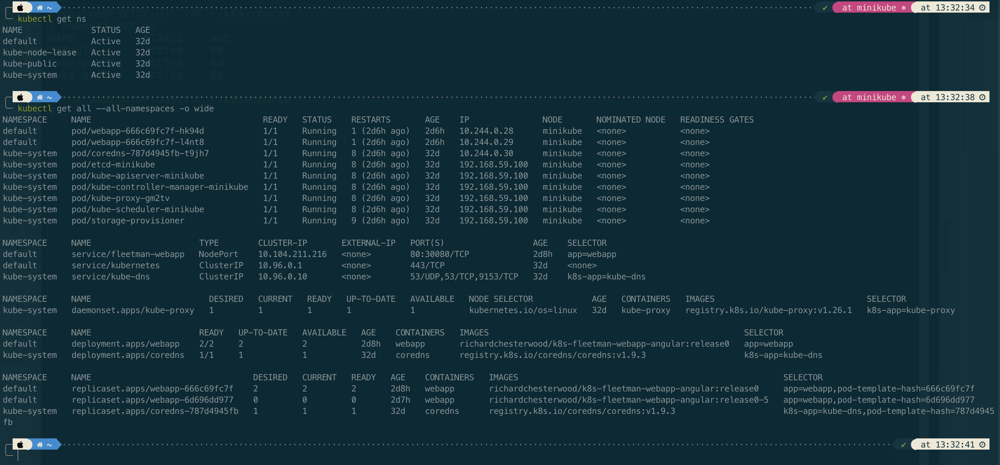
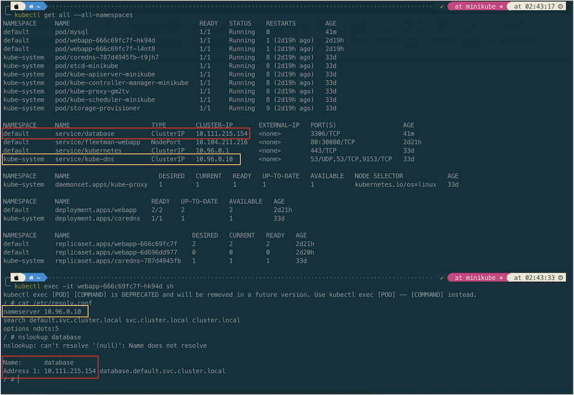
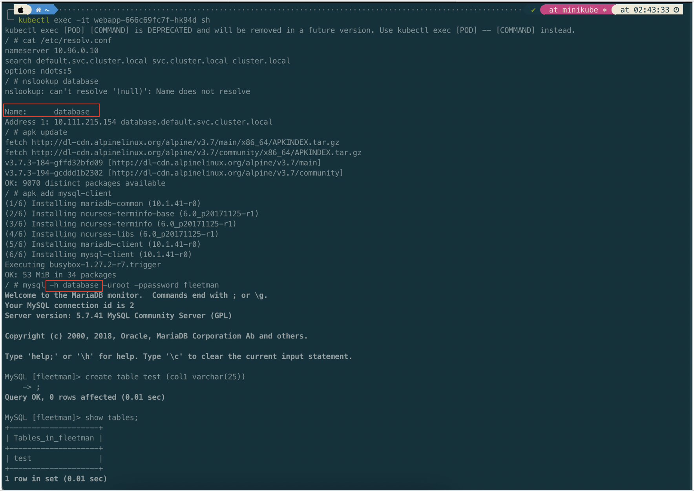

# How Network Container Work

Let's assume we have an app which stores data in MySql database. It is not a good idea to incorporate the app and database (MySql) in a single container. Docker container is designed to handle a single service. Eventhough it is possible a single container handling multiple service (app and database), but it is not a good design and not recommended.

In Kubernetes it is also possible to put multiple container in a single Pod. If we do that with the case of app and database, the app access the database as localhost with a specific port exposed by database container.


Eventhough designing multiple container in a single pod is acceptable and make the network simple, but it is not a good design and it's not recommended. 


Having an app and a database in a single Pod would make the Pod much more complicated to manage. If the Pod fails, then we are going to have to find out if it's failed because of the database container or the app container. Generally, it just makes things more complicated.

The recommended thing is the app and database should have seperated containers and also seperated Pods.

In previous section we know that the functionality of Pods are exposed as Services. Each of the Services has it's own private IP address. And the IP is just visible inside the Kubernetes cluster. If we want to communicate from the app Pod to the database Pod, we just refer to the IP address of the database Service. The IP address of the Services are allocated dynamically by Kubernetes. 


The next time we run the Kubernetes cluster, we may get different IP addresses allocated to the services. The solution is the Kubernetes maintains its own private DNS service. The DNS Service basically is a database containing a set of key value pairs. The keys are just label name of Kubernetes services and the values are the IP addresses of those Services. And Kubernetes takes full responsibility in maintaining this DNS system. The Kubernetes service which does the job is called <code>kube-dns</code>

# Namespace

Namespace basically is partioning resources in Kubernetes.



> In Kubernetes, if we don't specify namespace, it will be <code>default</code> namespace.

To get list of namespace we check with command
``` bash
# long command
kubectl get namespaces

# short command
kubectl get ns
```

We also can get resources by adding flag <code>--all-namespaces</code> for all namespaces and <code>-n</code> for specific namespace

``` bash
# get pods in kube-system namespace
kubectl get po -n kube-system

# get all resources in kube-system namespace
kubectl get all -n kube-system
```

 

 If we are in different namespace, we should specify the namespace
``` bash
kubectl describe svc kube-dns -n kube-system
```

# Working with Custom Namespace

``` bash
# creating a namespace
kubectl create ns demo

# run image inside a specific namespace 
kubectl run busybox -t -i --image busybox --namespace demo
```

# Service Discovery

To demonstrate service dicovery, let's create a Pod and Service (mysql.yaml) for a MySQL database. Then we will try to connect to the database from the previous web app Pod.

``` bash
apiVersion: v1
kind: Pod
metadata:
  name: mysql
  labels:
    app: mysql
spec:
  containers:
   - name: mysql
     image: mysql:5
     env:
      # Use secret in real implementation
      - name: MYSQL_ROOT_PASSWORD
        value: password
      - name: MYSQL_DATABASE
        value: fleetman
---
kind: Service
apiVersion: v1
metadata:
  name: database
spec:
  selector:
    app: mysql
  ports:
  - port: 3306
  type: ClusterIP

```

``` bash
kubectl apply -f mysql.yaml
```

How does the web app Pod know how to find the dns Service?. The answer is Kubernetes will automatically do some management of the containers and it automatically configures the DNS system. We can verify it by viewing the file in the <code>/etc/resolve.conf</code>


``` bash
# get into the Pod shell
kubectl exec -it webapp-666c69fc7f-hk94d sh
```



From the above screenshot we can see that the corresponding DNS entry for the database is <code>database.default.svc.cluster.local</code>. In short the general format of fully qualified domain name of service is <code>\<service-name\>.\<namespace-name\>.svc.cluster.local</code>

Let try to connect the MySql Pod from the web app Pod. Before doing that, we will install mysql client in the web app Pod.




> The important thing we have established here is that we can find the IP address of a service just by its name. That is called service discovery.

# Reference
- https://github.com/DickChesterwood/k8s-fleetman
- https://kubernetes.io/docs/reference/kubectl/cheatsheet/
- https://stackoverflow.com/questions/61171487/what-is-the-difference-between-namespaces-and-contexts-in-kubernetes
- https://loft.sh/blog/kubectl-get-context-its-uses-and-how-to-get-started/
- https://octopus.com/blog/deleting-kubernetes-resources
- https://stackoverflow.com/questions/55373686/how-to-switch-namespace-in-kubernetes