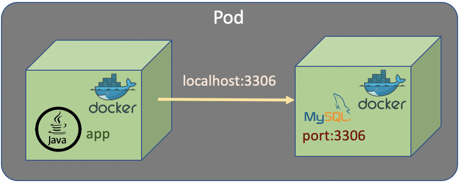
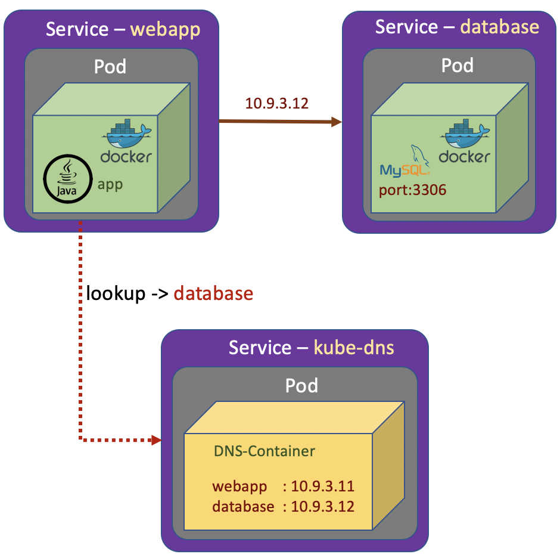

# How Network Container Work

Let's assume we have an app which stores data in MySql database. It is not a good idea to incorporate the app and database (MySql) in a single container. Docker container is designed to handle a single service. Eventhough it is possible a single container handling multiple service (app and database), but it is not a good design and not recommended.

In Kubernetes it is also possible to put multiple container in a single Pod. If we do that with the case of app and database, the app access the database as localhost with a specific port exposed by database container.

Eventhough designing multiple container in a single pod is acceptable and make the network simple, but it is not a good design and it's not recommended. 

Having an app and a database in a single Pod would make the Pod much more complicated to manage. If the Pod fails, then we are going to have to find out if it's failed because of the database contaier or the app container. Generally, it just makes things more complicated.

The recommended thing is the app and database should have seperated containers and also seperated Pods.

In previous section we know that the functionality of Pods are exposed as Services. Each of the Services has it's own private IP address. And the IP is just visible inside the Kubernetes cluster. If we want to communicate from the app Pod to the database Pod, we just refers to the IP address of the database Service. The IP address of the Services are allocated dynamically by Kubernetes. 

The next time we run the Kubernetes cluster, we may get differennt IP addresses allocated to the services. The solution is the Kubernetes maintains its own private DNS service. The DNS Service basically is a database containing a set of key value pairs. The key is just a label name of Kubernetes service and the values are the IP addresses of those Services. And Kubernetes takes full responsibility in maintaining this DNS system. Kubernetes service which does is called <code>kube-dns</code>

