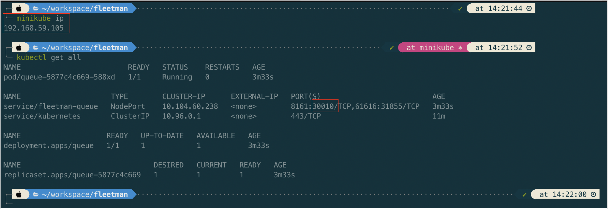

# Microservice 
In this lab, we will use example provided by [DickyChesterwood](https://github.com/DickChesterwood/k8s-fleetman/tree/release0-reconstruction-branch). The docker images are available on [Docker Hub](https://hub.docker.com/u/richardchesterwood)


The scenario as shown in the above diagram. The deployment steps are:
 

### 1. Queue (ActiveMQ)
First of all we will create <code>active-mq.yaml</code>
``` yaml
# ActiveMQ Deployment
apiVersion: apps/v1
kind: Deployment
metadata:
  name: queue
spec:
  selector:
    matchLabels:
      app: queue
  replicas: 1
  template: 
    metadata:
      labels:
        app: queue
    spec:
      containers:
      - name: queue
        image: richardchesterwood/k8s-fleetman-queue:release1

---
# ActiveMQ Service
apiVersion: v1
kind: Service
metadata:
  name: fleetman-queue

spec:
  # This defines which pods are going to be represented by this Service
  # The service becomes a network endpoint for either other services
  # or maybe external users to connect to (eg browser)
  selector:
    app: queue

  ports:
    - name: http
      port: 8161
      nodePort: 30010

    - name: endpoint
      port: 61616

  type: NodePort
```

``` bash
kubectl apply -f active-mq.yaml
```



Now open in browser http://192.168.59.105:30010/


> ActiveMQ default username/password is admin/admin


### 2. Position Tracker

``` yaml
apiVersion: apps/v1
kind: Deployment
metadata:
  name: position-tracker
spec:
  selector:
    matchLabels:
      app: position-tracker
  replicas: 1
  template: # template for the pods
    metadata:
      labels:
        app: position-tracker
    spec:
      containers:
      - name: position-tracker
        image: richardchesterwood/k8s-fleetman-position-tracker:release1
        env:
        - name: SPRING_PROFILES_ACTIVE
          value: production-microservice
---
apiVersion: v1
kind: Service
metadata:
  name: fleetman-position-tracker

spec:
  # This defines which pods are going to be represented by this Service
  # The service becomes a network endpoint for either other services
  # or maybe external users to connect to (eg browser)
  selector:
    app: position-tracker

  ports:
    - name: http
      port: 8080
      nodePort: 30011

  type: NodePort

```


When we hit through browser to http://192.168.59.105:30011/ we get 404 which means that the position tracker service (spring boot app) run well.

> For checking purpose we can let the position tracker as <code>NodePort</code>. 
> In Production phase, we can consider to change the <code>NodePort</code> to <code>ClusterIP</code> since position tracker microservice is not designed to be accessed from ouside cluster. 

``` yaml
apiVersion: apps/v1
kind: Deployment
metadata:
  name: position-tracker
spec:
  selector:
    matchLabels:
      app: position-tracker
  replicas: 1
  template: # template for the pods
    metadata:
      labels:
        app: position-tracker
    spec:
      containers:
      - name: position-tracker
        image: richardchesterwood/k8s-fleetman-position-tracker:release1
        env:
        - name: SPRING_PROFILES_ACTIVE
          value: production-microservice
---
apiVersion: v1
kind: Service
metadata:
  name: fleetman-position-tracker

spec:
  # This defines which pods are going to be represented by this Service
  # The service becomes a network endpoint for either other services
  # or maybe external users to connect to (eg browser)
  selector:
    app: position-tracker

  ports:
    - name: http
      port: 8080
      #nodePort: 30020

  #type: NodePort
  type: ClusterIP

```

### 3. Position Simulator

In the diagram, the position simulator is not designed to be accessed from outside the cluster. So it should be isolated and no port needed.

``` yaml
# Position Simulator Deployment
apiVersion: apps/v1
kind: Deployment
metadata:
  name: position-simulator
spec:
  selector:
    matchLabels:
      app: position-simulator
  replicas: 1
  template: # template for the pods
    metadata:
      labels:
        app: position-simulator
    spec:
      containers:
      - name: position-simulator
        image: richardchesterwood/k8s-fleetman-position-simulator:release1
        env:
        - name: SPRING_PROFILES_ACTIVE
          value: production-microservice
```

Save the above yaml as <code>position-simulator.yaml</code> and run apply command.
``` bash
kubectl apply -f position-simulator.yaml
```

Once the position simulator running, we should see queue record in the ActiveMQ dashboard.


### 4. API Gateway
``` yaml
apiVersion: apps/v1
kind: Deployment
metadata:
  name: api-gateway
spec:
  selector:
    matchLabels:
      app: api-gateway
  replicas: 1
  template: # template for the pods
    metadata:
      labels:
        app: api-gateway
    spec:
      containers:
      - name: api-gateway
        image: richardchesterwood/k8s-fleetman-api-gateway:release1
        env:
        - name: SPRING_PROFILES_ACTIVE
          value: production-microservice

---
apiVersion: v1
kind: Service
metadata:
  name: fleetman-api-gateway

spec:
  # This defines which pods are going to be represented by this Service
  # The service becomes a network endpoint for either other services
  # or maybe external users to connect to (eg browser)
  selector:
    app: api-gateway

  ports:
    - name: http
      port: 8080
      nodePort: 30020

  type: NodePort
```

### 5. Webapp
``` yaml
apiVersion: apps/v1
kind: Deployment
metadata:
  name: webapp
spec:
  selector:
    matchLabels:
      app: webapp
  replicas: 1
  template: # template for the pods
    metadata:
      labels:
        app: webapp
    spec:
      containers:
      - name: webapp
        image: richardchesterwood/k8s-fleetman-webapp-angular:release1
        env:
        - name: SPRING_PROFILES_ACTIVE
          value: production-microservice

---
apiVersion: v1
kind: Service
metadata:
  name: fleetman-webapp

spec:
  # This defines which pods are going to be represented by this Service
  # The service becomes a network endpoint for either other services
  # or maybe external users to connect to (eg browser)
  selector:
    app: webapp

  ports:
    - name: http
      port: 80
      nodePort: 30080

  type: NodePort
```


# Investigating Kubernates Log
If we get an error on resource we can chek
``` bash
# get pod description including kubernetes message while creating/updating the pod
kubectl describe pod position-simulator-56686f95f8-xx2t8

# get the application log
kubectl logs position-simulator-56686f95f8-xx2t8

# get the application log by following the log
kubectl logs -f position-simulator-56686f95f8-xx2t8
```

# References
1. https://github.com/DickChesterwood/k8s-fleetman/tree/release0-reconstruction-branch
2. https://www.nginx.com/blog/microservices-at-netflix-architectural-best-practices/