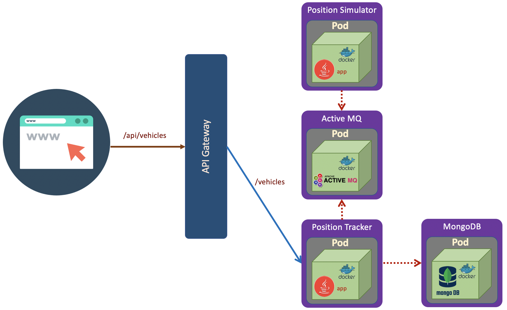

# Persistence with MongoDB

Previous microservices example has no data persistence. In this sectio we will add MongoDB as data persistence which stores historical position of trucks. 
 


### MongoDB Microservice
We will deploy MongoDB with the following specification.

``` yaml
apiVersion: apps/v1
kind: Deployment
metadata:
  name: mongodb
spec:
  selector:
    matchLabels:
      app: mongodb
  replicas: 1
  template: # template for the pods
    metadata:
      labels:
        app: mongodb
    spec:
      containers:
      - name: mongodb
        image: mongo:3.6.5-jessie

---
kind: Service
apiVersion: v1
metadata:
  name: fleetman-mongodb
spec:
  selector:
    app: mongodb
  ports:
    - name: mongoport
      port: 27017
  type: ClusterIP

```

### Updating Container Images
In this lab we will use example provided by of [DickChesterwood](https://github.com/DickChesterwood/k8s-fleetman/tree/release3). In the position tracker API, we can see the MongoDB configuration in the <code>application-production-microservice.properties</code>. The address of MongoDB is fully qualified domain name <code>**fleetman-mongodb**.default.svc.cluster.local</code>

``` bash
spring.activemq.broker-url=tcp://fleetman-queue.default.svc.cluster.local:61616
fleetman.position.queue=positionQueue

# We'll use the default port 8080 for all microservices in production cluster.

# TODO but this is reasonable guess! This may change when we scale it out...
spring.data.mongodb.host=fleetman-mongodb.default.svc.cluster.local
```

Before demonstrating the persistence with MongoDB, we will update several images used in previous section and apply them in Kubernetes cluster.

<sub>*List of updated pod image*</sub>

| Pod    | Image |
| -------- | ------- |
| Queue (ActiveMQ)  | richardchesterwood/k8s-fleetman-queue:release2    |
| Position Tracker     | richardchesterwood/k8s-fleetman-position-tracker:release3 |
| Position Simulator     | richardchesterwood/k8s-fleetman-position-simulator:release2 |
| API Gateway           | richardchesterwood/k8s-fleetman-api-gateway:release2 |
| WebApp            | richardchesterwood/k8s-fleetman-webapp-angular:release2 |'
