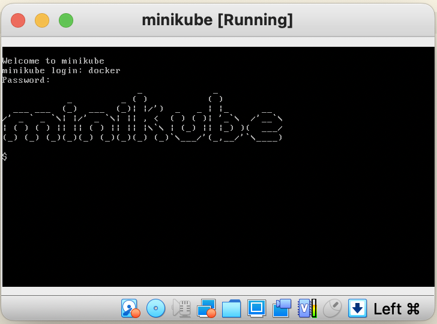
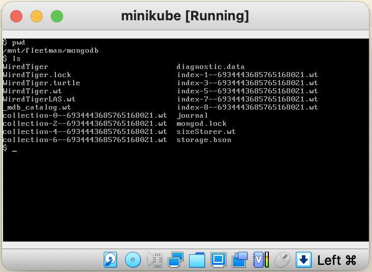

# Persistence with MongoDB

Previous microservices example has no data persistence. In this sectio we will add MongoDB as data persistence which stores historical position of trucks. 
 


### MongoDB Microservice
We will deploy MongoDB with the following specification.

``` yaml
apiVersion: apps/v1
kind: Deployment
metadata:
  name: mongodb
spec:
  selector:
    matchLabels:
      app: mongodb
  replicas: 1
  template: # template for the pods
    metadata:
      labels:
        app: mongodb
    spec:
      containers:
      - name: mongodb
        image: mongo:3.6.5-jessie

---
kind: Service
apiVersion: v1
metadata:
  name: fleetman-mongodb
spec:
  selector:
    app: mongodb
  ports:
    - name: mongoport
      port: 27017
  type: ClusterIP

```

### Updating Container Images
In this lab we will use example provided by of [DickChesterwood](https://github.com/DickChesterwood/k8s-fleetman/tree/release3). In the position tracker API, we can see the MongoDB configuration in the <code>application-production-microservice.properties</code>. The address of MongoDB is fully qualified domain name <code>**fleetman-mongodb**.default.svc.cluster.local</code>

``` bash
spring.activemq.broker-url=tcp://fleetman-queue.default.svc.cluster.local:61616
fleetman.position.queue=positionQueue

# We'll use the default port 8080 for all microservices in production cluster.

# TODO but this is reasonable guess! This may change when we scale it out...
spring.data.mongodb.host=fleetman-mongodb.default.svc.cluster.local
```

Before demonstrating the persistence with MongoDB, we will update several images used in previous section and apply them in Kubernetes cluster.

<sub>*List of updated pod image*</sub>

| Pod    | Image |
| -------- | ------- |
| Queue (ActiveMQ)  | richardchesterwood/k8s-fleetman-queue:release2    |
| Position Tracker     | richardchesterwood/k8s-fleetman-position-tracker:release3 |
| Position Simulator     | richardchesterwood/k8s-fleetman-position-simulator:release2 |
| API Gateway           | richardchesterwood/k8s-fleetman-api-gateway:release2 |
| WebApp            | richardchesterwood/k8s-fleetman-webapp-angular:release2 |'

# Storing MongoDB Database Outside Container (Host)

### Volumes
 Volumes allows us to store data outside a pod. In the following example we will store data at the host of node.
 Thus, when the Pod crashes, the data will not lost.

``` yaml
apiVersion: apps/v1
kind: Deployment
metadata:
  name: mongodb
spec:
  selector:
    matchLabels:
      app: mongodb
  replicas: 1
  template: # template for the pods
    metadata:
      labels:
        app: mongodb
    spec:
      containers:
      - name: mongodb
        image: mongo:3.6.5-jessie
        volumeMounts:
          - name: mongo-persistent-storage
            mountPath: /data/db # MongoDB store data inside the container
      volumes:
        - name: mongo-persistent-storage
          # This AWS EBS volume must already exist.
          #awsElasticBlockStore:
          #....

          # This is Azure data storage
          #azureDisk
          #.....

          # This is local disk of node (host)
          hostPath:
             path: /mnt/fleetman/mongodb
             type: DirectoryOrCreate
---
kind: Service
apiVersion: v1
metadata:
  name: fleetman-mongodb
spec:
  selector:
    app: mongodb
  ports:
    - name: mongoport
      port: 27017
  type: ClusterIP

```

Open VirtualBox, the double clik minikube VM which is currently running. It will pop up a windows and prompt login to minikube.
We can login to the minikube host using 
```
username : docker
password : tcuser
```





### PersistentVolumeClaim, StorageClass and Binding
To make persistent configuration of Pod more clean, we can separated the volume persistent configuration outside the Pod configuration. The Pod just refers to the peristent volume configuration. Our pod yaml does not have to be changed when we move from one cloud provider to another. We just change the persistent config which is referenced by the Pod. Ideally it cound be in separated yaml file. 

A PersistentVolume (PV) is a piece of storage in the cluster that has been provisioned by an administrator or dynamically provisioned using Storage Classes. It is a resource in the cluster just like a node is a cluster resource. PVs are volume plugins like Volumes, but have a lifecycle independent of any individual Pod that uses the PV. This API object captures the details of the implementation of the storage, be that NFS, iSCSI, or a cloud-provider-specific storage system.

Let's modified the Mongo Pod definition using the PersistentVolume.
``` yaml
apiVersion: apps/v1
kind: Deployment
metadata:
  name: mongodb
spec:
  selector:
    matchLabels:
      app: mongodb
  replicas: 1
  template: # template for the pods
    metadata:
      labels:
        app: mongodb
    spec:
      containers:
      - name: mongodb
        image: mongo:3.6.5-jessie
        volumeMounts:
          - name: mongo-persistent-storage
            mountPath: /data/db # MongoDB store data inside the container
      volumes:
        - name: mongo-persistent-storage
          # pointer to the configuration of HOW we want the mount to be implemented
          persistentVolumeClaim:
            claimName: mongo-pvc
---
kind: Service
apiVersion: v1
metadata:
  name: fleetman-mongodb
spec:
  selector:
    app: mongodb
  ports:
    - name: mongoport
      port: 27017
  type: ClusterIP

```

So the general point of this, the mongodb Pod does not have specific implementation detail. The detail definition of the storage is put outside Pod definition.

In this lab, we use local storage to store mongodb database. To define the specific detail of storage we need to define PersistentVolumeClaim definition. We do that with the following <code>storage.yaml</code>

``` yaml
# Storage specification that's expected
apiVersion: v1
kind: PersistentVolumeClaim
metadata:
  name: mongo-pvc
spec:
  storageClassName: mylocalstorage
  accessModes:
    - ReadWriteOnce
  resources:
    requests:
      storage: 20Gi
---
# storage that will be created to fullfil the storage expectation
apiVersion: v1
kind: PersistentVolume
metadata:
  name: local-storage
spec:
  storageClassName: mylocalstorage
  capacity:
    storage: 20Gi
  accessModes:
    - ReadWriteOnce
  hostPath:
    path: "/mnt/fleetman-new/mongodb"
    type: DirectoryOrCreate

```

# References
1. https://kubernetes.io/docs/concepts/storage/
2. https://kubernetes.io/docs/concepts/storage/persistent-volumes/