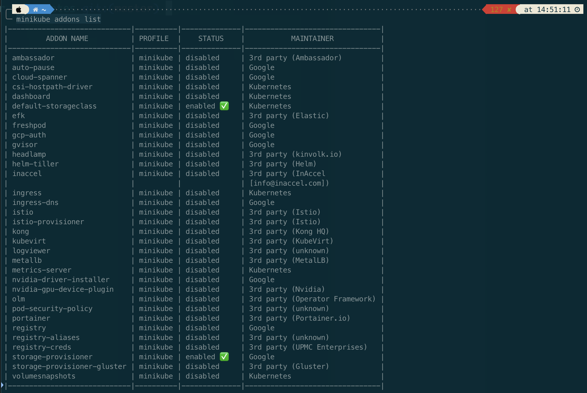

# Checking Minikube Addons

First let's check list of addons which available in Minikube.
``` bash
minikube addons list
```



``` bash
# activate the ingress addon
minikube addons enable ingress 
```

After installing ingress addons, we can check it in the kube-system namespace.

``` bash
kubectl get all --namespace kube-system
```